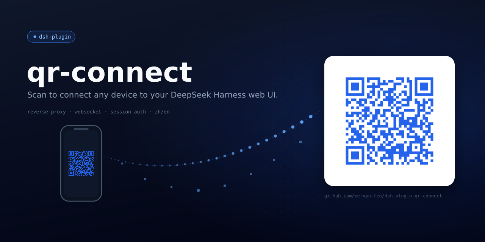

# dsh-plugin-qr-connect

  

[English](README.md) | 中文

一个 [DeepSeek Harness](https://github.com/deepseek-ai/deepseek-harness)（DSH）动态
Cordis 插件：在侧边栏底部「设置」按钮上方添加一个 **二维码按钮**。它运行一个小型、
带鉴权的反向代理，让同一网络（或公网）上的手机扫码后安全地打开 Web UI。

## 功能

- 添加一个全宽按钮（`sidebar.footer.action`，id `qr-connect`），堆叠在官方
  「插件」按钮上方。
- 点击后打开一个淡入淡出的面板，显示 **两个** 二维码：
  - **本地网络** — `http://<局域网 IP>:<端口>/?auth=<密钥>`。
  - **公网** — `http://<公网 IP>:<端口>/?auth=<密钥>`（蓝色）。
- 反向代理（一个监听 `0.0.0.0:<端口>` 的 `node` 子进程）校验密钥，签发会话
  Cookie（默认 30 天），然后转发到回环 Web UI。
- 密钥默认每 30 秒轮换一次，二维码同步刷新（可配置，`0` 表示关闭自动刷新）。
- 点击二维码复制对应链接；公网二维码带有信息提示（悬浮显示「公网分享」）。
- 在 设置 → 插件 中提供 **QR connect** 配置卡片，可设置代理端口、会话时长、
  刷新间隔。
- 通过 DSH 的 locale 服务支持英文与中文界面。

## 文件

| 文件 | 用途 |
| --- | --- |
| `host.js` | Host 半边 —— `cordis_define` 中 `code.host` 的值。 |
| `client.js` | Client 半边 —— `cordis_define` 中 `code.client` 的值。 |
| `package.json` | 包元数据（`dsh-plugin` 关键字 + `dsh` 清单）。 |

## 加载方式

这是一个 **动态 Cordis 插件**：运行在 DSH 会话内，进程重启后不会保留。在 DSH
Web 界面（或由代理）通过 `cordis_define` / `cordis_run` 流程加载：

1. 定义新插件，`code.host` = `host.js` 的完整内容，`code.client` =
   `client.js` 的完整内容（`idPrefix` 用 `qrconn` 即可，最终 ID 由宿主分配）。
2. 运行返回的包，并在界面中批准 Client 半边。

这两个 `.js` 文件是动态运行器所需的 **函数体**（不是独立的 Node/浏览器模块），
请原样传入，不要 `import`。

## 依赖

- DSH 需要挂载 `shell`、`subprocess`、`fs`、`webServer` 服务。
- DSH 宿主的 `PATH` 中有 `node`，并有 `curl` 用于查询公网 IP。
- 扫码设备需要能访问代理端口（宿主机防火墙可能需要放行）；公网二维码还需要
  公网可访问（端口转发）。

## 安全

该代理会把完整的 agent shell 暴露给任何能访问该端口的设备，仅靠 30 秒密钥和
会话 Cookie 保护。请使用较短的会话时长，将其视为可信网络内的便利工具，而不是
强化的远程访问层。

## 许可证

[MIT](LICENSE)
